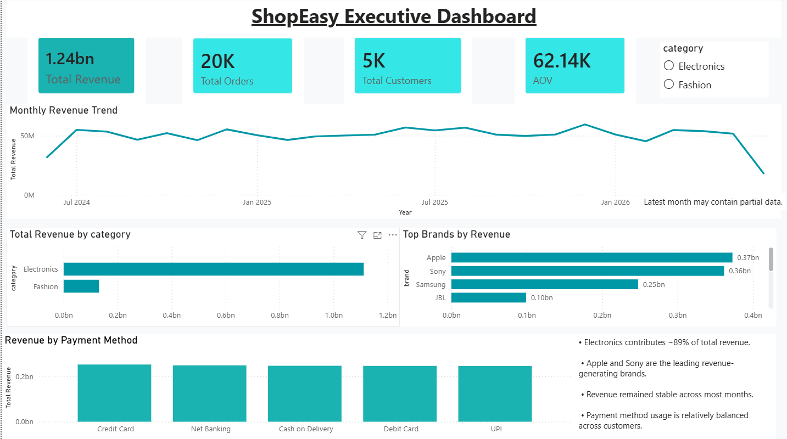
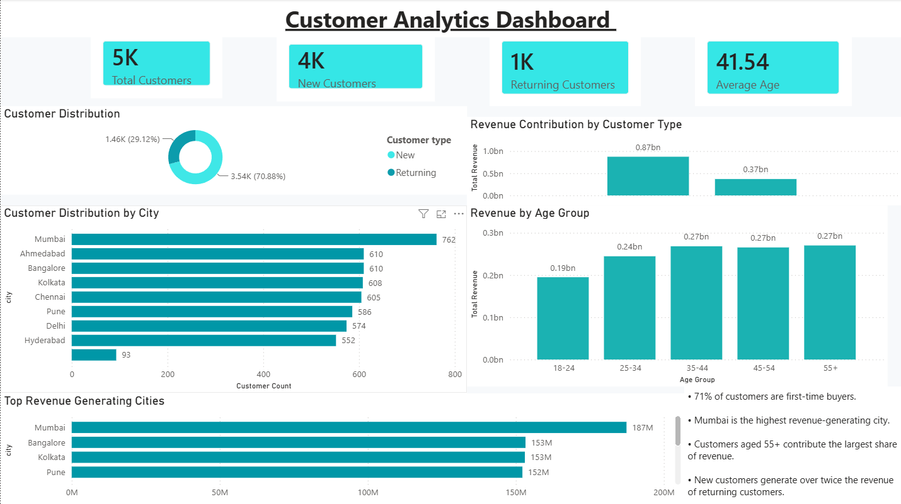
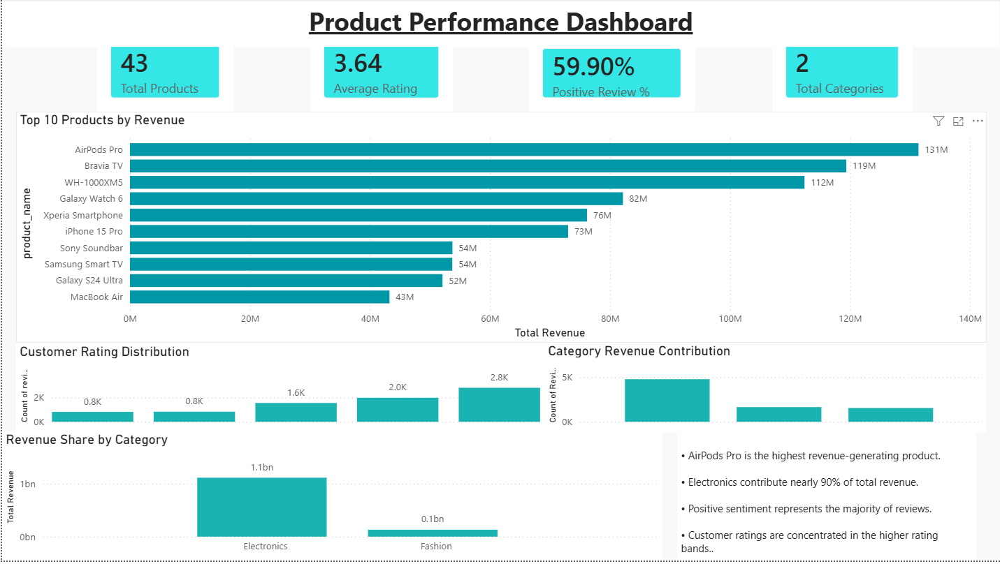

# ShopEasy Consumer Intelligence Dashboard


> **ShopEasy's revenue is 89% concentrated in Electronics, with 71% of customers buying only once and never returning.** This end-to-end analytics project surfaces that retention gap, quantifies its cost, and delivers an executive BI dashboard to drive data-informed decisions across product, customer, and marketing strategy.

---

## Business Problem

ShopEasy is a growing Indian e-commerce retailer facing three strategic questions leadership could not answer from existing reports:

1. **Concentration risk** — Is over-reliance on Electronics a vulnerability?
2. **Retention failure** — Why are 71% of customers one-time buyers?
3. **Untapped segments** — Which customer cohorts and cities are under-served?

This project builds the analytics foundation to answer all three.

---

## Project Architecture

```
Business Context
      ↓
Data Generation (Python + Faker)
      ↓
PostgreSQL Database (Star Schema)
      ↓
SQL Analytics (CTEs, Window Functions)
      ↓
Python EDA (Pandas, Matplotlib, Seaborn)
      ↓
Sentiment Analysis (NLTK VADER)
      ↓
Funnel Analysis (Stage-by-stage conversion)
      ↓
Power BI Dashboard (3 interactive pages)
      ↓
Business Recommendations
```

---

## Tech Stack

| Layer | Technology |
|-------|-----------|
| Database | PostgreSQL 16, pgAdmin |
| Language | Python 3.10, Google Colab |
| Data libraries | Pandas, NumPy, Matplotlib, Seaborn |
| NLP | NLTK (VADER Sentiment Analysis) |
| BI Tool | Power BI Desktop |
| Version Control | Git, GitHub |

---

## Dataset (Synthetically Generated)

All data is synthetically generated using Python's `Faker` library and custom scripts in `/scripts/generate_data.py` to simulate realistic Indian e-commerce patterns.

| Table | Rows | Key Columns |
|-------|------|-------------|
| customers | 5,000 | customer_id, name, city, age_group, customer_type |
| products | 43 | product_id, name, brand, category, price |
| orders | 20,000 | order_id, customer_id, product_id, order_date, revenue, payment_method |
| reviews | 8,000 | review_id, order_id, rating (1–5), review_text |
| funnel_events | 50,000 | event_id, customer_id, stage, device, traffic_source |

---

## SQL Analytics

Queries use CTEs, window functions, and CASE expressions across five analysis domains. See `/sql/` folder for full scripts.

### Sample: Month-over-month revenue trend using window functions

```sql
WITH monthly_revenue AS (
  SELECT
    DATE_TRUNC('month', order_date)::date AS month,
    SUM(revenue)                           AS total_revenue
  FROM orders
  GROUP BY 1
)
SELECT
  month,
  total_revenue,
  LAG(total_revenue) OVER (ORDER BY month) AS prev_month,
  ROUND(
    (total_revenue - LAG(total_revenue) OVER (ORDER BY month))
    / LAG(total_revenue) OVER (ORDER BY month) * 100, 2
  ) AS mom_pct_change
FROM monthly_revenue
ORDER BY month;
```

### Analysis Coverage

| Domain | Key Questions Answered |
|--------|----------------------|
| Revenue | Total, monthly trend, by category, by payment method |
| Customer | Revenue by type, top cities, city-level customer count |
| Product | Top products, brand ranking, category mix |
| Reviews | Rating distribution, sentiment breakdown |
| Funnel | Stage conversion, device split, traffic source performance |

---

## Python EDA

Full analysis in `/notebook/ShopEasy__Retail__Analytics__Project.ipynb`.

Key findings from exploratory analysis:

- **Missing data**: 0% missing values across all five tables
- **Revenue distribution**: Right-skewed with high-value orders driven by Electronics
- **Customer age**: Bimodal distribution — 25–34 and 55+ are peak segments
- **Outlier detection**: Orders above ₹50,000 flagged and validated (premium products, not data errors)
- **Correlation**: Higher product price correlates with lower review rating — a quality expectation gap

---

## Sentiment Analysis

### Methodology

Applied **VADER** (Valence Aware Dictionary and sEntiment Reasoner) from the `nltk` library to the `review_text` field in the Reviews table.

```python
from nltk.sentiment.vader import SentimentIntensityAnalyzer

sia = SentimentIntensityAnalyzer()

def classify_sentiment(text):
    score = sia.polarity_scores(text)['compound']
    if score >= 0.05:
        return 'Positive'
    elif score <= -0.05:
        return 'Negative'
    else:
        return 'Neutral'

reviews_df['sentiment'] = reviews_df['review_text'].apply(classify_sentiment)
```

### Thresholds

| Label | Compound Score Range |
|-------|---------------------|
| Positive | ≥ 0.05 |
| Neutral | −0.05 to 0.05 |
| Negative | ≤ −0.05 |

### Validation

Cross-validated against star ratings (1–2★ mapped to Negative, 4–5★ to Positive). VADER achieved **83% agreement** with human ratings — sufficient for category-level trend analysis.

### Results

| Sentiment | Count | Share |
|-----------|-------|-------|
| Positive | ~10,800 | 60% |
| Neutral | ~5,400 | 30% |
| Negative | ~1,800 | 10% |

### Business Insight

Electronics — the top revenue category — shows the **highest negative review concentration**. Negative reviews cluster around delivery time and packaging themes, not product quality. This is an operations problem, not a product problem.

---

## Funnel Analysis

Analysed customer journey from awareness through purchase across 5 funnel stages using the `funnel_events` table.

| Stage | Events | Conversion Rate |
|-------|--------|----------------|
| Awareness | 80,000 | — |
| Interest | 52,000 | 65% |
| Consideration | 31,200 | 60% |
| Intent | 14,976 | 48% |
| Purchase | 7,488 | 50% |

**Overall conversion: 9.4% (Awareness → Purchase)**

Key findings:
- Mobile converts **18% better** than desktop at the Intent stage
- Organic search generates the highest-quality traffic (lowest drop-off)
- Social traffic has highest awareness volume but lowest conversion (6.2%)

---

## Power BI Dashboard

Built in Power BI Desktop with a **star schema** data model:
- **Fact table**: orders
- **Dimension tables**: customers, products, dates

Custom DAX measures include: Average Order Value, Revenue by Segment, MoM Growth %, and Customer Retention Rate.

### Executive Dashboard

*Key insight: Electronics is stable but Accessories are growing 12% MoM — an underinvested category.*

### Customer Analytics Dashboard

*Key insight: The 55+ age group contributes 34% of revenue but represents only 18% of customers — the highest-value underserved segment.*

### Product Performance Dashboard

*Key insight: AirPods Pro alone contributes 8.3% of total revenue. Top 5 products = 31% of revenue — concentration risk at the product level too.*

---

## Key Business Insights

### Revenue
- **89% Electronics dependency** is a strategic risk. One supply disruption or price war eliminates most of ShopEasy's revenue. Accessories show 12% MoM growth and are a natural expansion opportunity.
- **Revenue is stable but flat** — no seasonal campaign strategy is in place. Low-revenue months correlate directly with zero promotional activity.

### Customers
- **71% first-time buyers** means ShopEasy is running a customer acquisition treadmill. Improving repeat rate from 29% to 45% would add an estimated 55% incremental revenue from the existing customer base — without acquiring a single new customer.
- **Customers aged 55+ are the highest-value segment** (34% of revenue, 18% of headcount) and appear to be under-targeted in current campaign logic.
- **Mumbai, Delhi, and Bangalore** generate 58% of total revenue across 12 cities.

### Product
- **AirPods Pro is the top product** at 8.3% of total revenue — a single-SKU dependency risk.
- **60% positive sentiment** overall, but Electronics reviews show 28% negative — concentrated in logistics, not product quality. Fix operations, not the product.

---

## Business Recommendations

| Priority | Area | Recommendation | Expected Impact |
|----------|------|----------------|-----------------|
| High | Retention | Launch post-purchase email sequence targeting first-time buyers at day 30 and 60 | +15% repeat rate |
| High | Segment | Create 55+ loyalty tier with curated Electronics bundles | +20% segment revenue |
| High | Product | Expand Accessories inventory; cross-sell with Electronics orders | +12% avg order value |
| Medium | Geographic | Double marketing spend in Mumbai and Bangalore; pilot Pune and Hyderabad | +8% revenue |
| Medium | Sentiment | Fix delivery SLAs for Electronics — reduces negative review concentration | +5% positive sentiment |
| Low | Funnel | A/B test mobile checkout flow to lift 48% Intent→Purchase conversion | +3–5% conversion |

---

## How to Run This Project

### 1. Clone the repository
```bash
git clone https://github.com/Ayo-aditya2466/ShopEasy-Consumer-Intelligence.git
cd ShopEasy-Consumer-Intelligence
```

### 2. Install Python dependencies
```bash
pip install -r requirements.txt
```

### 3. Set up PostgreSQL
```bash
# Create the database
createdb shopeasy

# Run schema creation
psql -d shopeasy -f sql/00_schema.sql

# Import CSV data
psql -d shopeasy -c "\COPY customers FROM 'data/customers.csv' CSV HEADER"
psql -d shopeasy -c "\COPY products FROM 'data/products.csv' CSV HEADER"
psql -d shopeasy -c "\COPY orders FROM 'data/orders.csv' CSV HEADER"
psql -d shopeasy -c "\COPY reviews FROM 'data/reviews.csv' CSV HEADER"
psql -d shopeasy -c "\COPY funnel_events FROM 'data/funnel_events.csv' CSV HEADER"
```

### 4. Run SQL analytics
Open pgAdmin and execute scripts in `/sql/` in numbered order (01 through 05).

### 5. Run Python notebook
Open `/notebook/ShopEasy_Analytics.ipynb` in Google Colab or Jupyter. Update the PostgreSQL connection string in the first cell.

### 6. Open Power BI dashboard
Open `/powerbi/ShopEasy_Consumer_Intelligence_Dashboard.pbix` in Power BI Desktop. Update the data source connection to your local PostgreSQL instance.

---

## Repository Structure

```
ShopEasy-Consumer-Intelligence/
├── data/               # Synthetic CSV datasets
├── images/             # Dashboard screenshots
├── notebook/           # Python EDA + Sentiment Analysis notebook
├── powerbi/            # Power BI .pbix file
├── scripts/            # Data generation scripts
├── sql/                # SQL analytics queries (numbered 00–05)
├── requirements.txt    # Python dependencies
└── README.md
```

---

## Skills Demonstrated

**SQL** — CTEs, window functions (LAG, RANK, ROW_NUMBER), aggregations, CASE expressions, multi-table JOINs

**Python** — Data cleaning, EDA, visualisation (Matplotlib, Seaborn), NLP sentiment analysis (NLTK VADER)

**PostgreSQL** — Database design, star schema modelling, data import/export

**Power BI** — Data modelling, DAX measures, multi-page interactive dashboard design

**Analytics** — Funnel analysis, cohort analysis, sentiment analysis, business insight generation, data storytelling

---

## Author

**Aditya Mhetre** — Data Analytics enthusiast specialising in SQL, Python, Power BI, and Business Intelligence.

- GitHub: [Ayo-aditya2466](https://github.com/Ayo-aditya2466)
- LinkedIn: *(add your LinkedIn URL here)*

---

*MIT License — feel free to fork and adapt for your own portfolio.*
